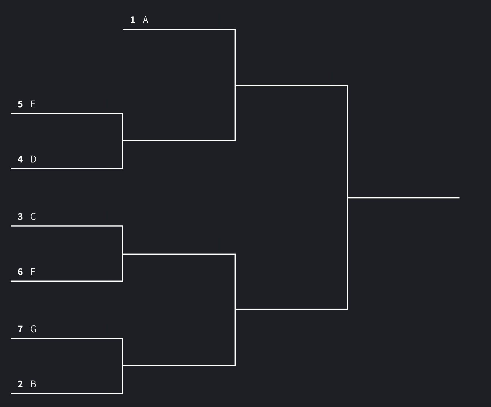

# Bags Tournament:

A 3 hour bags tournament.

Max of 32 teams.

## Setup

Label board numbers. Spray paint board numbers in the grass? 

* Tent
* Tables
* Water
* Big board for pool play and times
* Big Board for bracket
* zip ties or something to get the banner up
* flags (they might be the wiffle ball foul poles though)

## Pool Play:

Each team is placed into a pool and each pools has 4 teams.

Each team plays every other team in their pool. (3 games)

The winner of the pool (record) will move onto bracket play. Tie breakers are settld by head to head record.

Pool play games are 15 point games, first to 15 wins.

Opponents will do a coin flip (maybe we can give out voyager coins?). Winner decides who goes first.

| Boards | Pool | Time |
|-|-|-|
|1-2 | A | 12:00 - 1:00 |
|3-4 | B | 12:00 - 1:00 |
|5-6 | C | 12:00 - 1:00 |
|7-8 | D | 12:00 - 1:00 |
|1-2 | E | 1:00 - 2:00 |
|3-4 | F | 1:00 - 2:00 |
|5-6 | G | 1:00 - 2:00 |
|7-8 | H | 1:00 - 2:00 |

## Bracket Play:

There are up to 8 spots available in bracket play. The winner of each pool gets one spot. If there are not enough registrations to fill up all 8 spots, .e. only 6.5 pools filled up, a seeded bracked will be created to handle this.

Build the bracket using this site:
https://brackethq.com/maker/ Winner of A pool is seed 1, winner B pool is seed 2, etc.

Bracket play games are to 21 points and you must win by 2.

### Example:
 26 people registered, filling 6 pools up with a 7th pool only having 2 people.

The 2 people in pool 7 would play each other to determine who wins the pool. All other pool play would be normal.

In this case we need to make a 7 team seeded bracket because we only had seven pools.

  

Bracket play games should only ever need 4 boards.  All other boards can be cleaned up at this time.

## Registration

We will accept registrants until all the pools are filled, bracket play has started, or 1 hour has passed. 

Pools can be filled as people arrive. When someone arrives they get put into the next open pool.  Don't let people pick pools, place them into next available.  (you can always use judgement here)

For pools F,G, and H (the last pools to fill) try to avoid ending up with 1 extra person and all other pools filled.  If it happens it won't break anything, but having a 3 person pool and a 2 person pool as the final pools is preferrable than a 4 person pool and 1 person pool.

### When a team arrives:

* Welcome them and confirm registration and donation.
* Add them to the next open pool (A - H)
* Explain pool play format.
* Explain to them the time and location of their matches.
* Give them a voyagers coin.
* Ask if they have any rules questions.
* Ask if they have heard of the voyagers program.
* Ask them to spread the word, because voyagers is a great program.
* Solicit a donation to nourish 282. (tap the jar)
